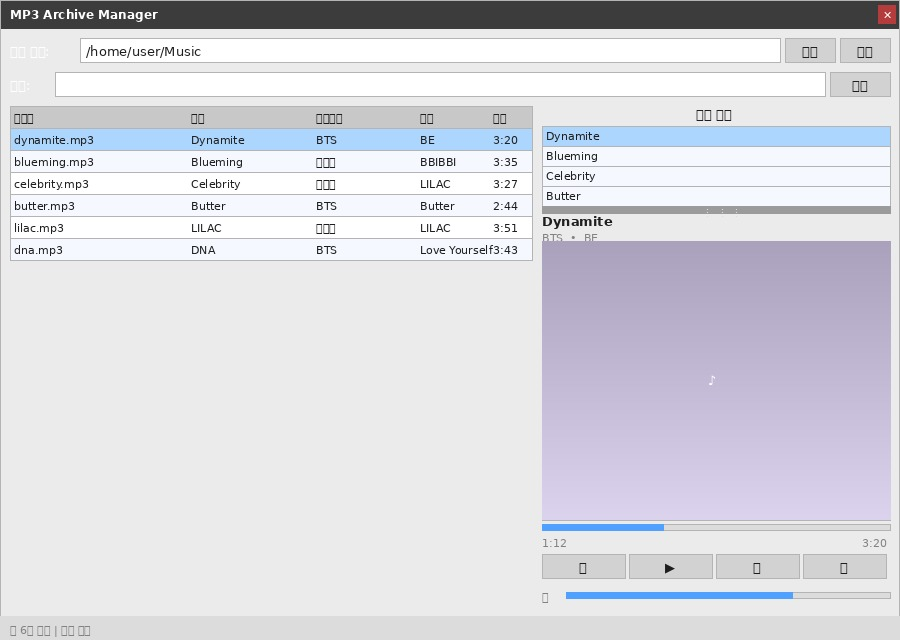
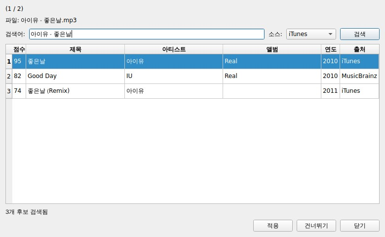
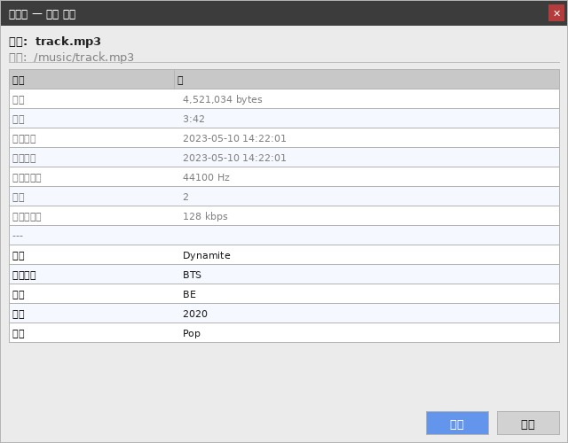
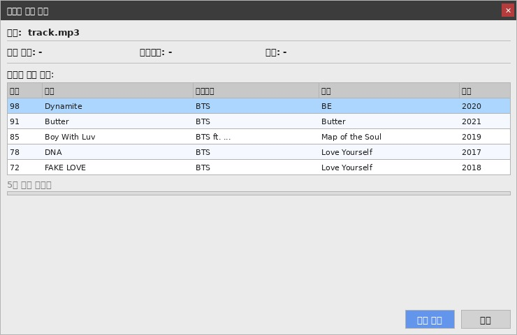
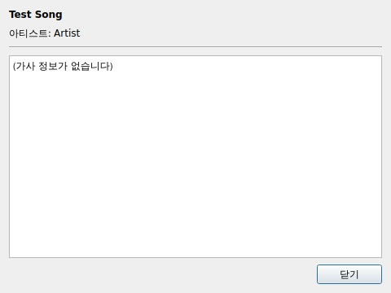

# mp3-archive

오디오 파일을 재귀적으로 스캔하여 메타데이터를 SQLite DB에 저장하고 관리하는 데스크톱 애플리케이션입니다.

## UI 프리뷰



---

## 기능

### 파일 스캔 및 관리

- **다양한 포맷 지원**: MP3, FLAC, OGG, WAV, M4A, WMA, Opus
- ID3 / VorbisComment / MP4 / ASF 태그 자동 읽기; 태그 없으면 파일명(`아티스트 - 제목.ext`)에서 파싱
- **증분 스캔**: 변경된 파일만 업데이트 (빠름) / **전체 스캔**: 모든 파일 강제 재읽기
- 파일 생성일시 / 수정일시 추적
- 경로 설정 저장 (QSettings, 앱 재시작 시 복원)
- 레코드 선택 삭제

### 재생

- 재생 목록에서 더블클릭으로 재생, 이전/다음 곡 이동
- 현재 재생 중인 곡의 앨범 아트 표시 (스플리터로 크기 조절 가능)

### 검색

- 파일명 검색 (기본) 또는 "태그 포함" 체크 시 제목·아티스트·앨범·장르·년도·코멘트 전체 검색
- 실시간 필터링 (타이핑하는 동시에 결과 갱신)

### 테이블

- 파일명, 경로, 제목, 아티스트, 앨범, 장르, 년도, 길이, 크기, 생성일시, 수정일시 표시
- 컬럼 헤더 클릭으로 정렬
- **헤더 우클릭**으로 표시할 컬럼 선택/숨김 (설정 저장됨)
- 모든 셀 호버 시 전체 내용 툴팁 표시

### 태그 관리

- **태그 자동 완성**: MusicBrainz 또는 iTunes에서 태그를 검색해 파일과 DB에 자동 적용
  - 소스 선택 가능: MusicBrainz / iTunes / 둘 다 (Both)
  - 검색어 직접 입력하여 재검색 가능
  - 검색 결과 없을 시 팝업 알림
- **우클릭 메뉴**:
  - `자세히` — 파일에 내장된 모든 태그 + 앨범 아트 팝업 (편집 가능)
  - `인터넷에서 정보 보기` — MusicBrainz 곡 정보 조회 팝업
  - `가사 보기` — 파일에 내장된 가사 팝업
  - `태그 찾기` — 해당 행 태그 개별 검색

---

## 다이얼로그 프리뷰

### 태그 자동 완성 (`tag_fetch_dialog`)

MusicBrainz / iTunes 에서 태그를 검색하여 일괄 적용합니다.
태그가 없는 파일만 큐에 올라오며, 파일명을 검색어 기본값으로 사용합니다.



---

### 태그 상세 보기 (`tag_detail_dialog`)

파일에 내장된 모든 태그 키-값을 테이블로 표시하며, 앨범 아트도 함께 보여줍니다.
편집 가능한 셀을 수정 후 저장 버튼으로 파일과 DB에 반영합니다.



---

### 인터넷 곡 정보 (`song_info_dialog`)

MusicBrainz에서 선택한 곡의 정보를 조회하고 태그로 적용할 수 있습니다.



---

### 가사 보기 (`lyrics_dialog`)

파일에 내장된 가사를 표시합니다.
ID3 USLT (MP3), Vorbis LYRICS (FLAC/OGG), MP4 ©lyr 포맷을 지원합니다.



---

## 요구사항

```
pip install -r requirements.txt
```

- Python 3.10+
- PyQt6
- mutagen
- musicbrainzngs

## 실행

```bash
python main.py
```

또는 직접 실행:

```bash
python src/main_window.py
```

## 빌드

### Windows

```bash
pyinstaller build/windows.spec
# 결과물: dist/mp3-archive.exe
```

### Linux

```bash
pyinstaller build/linux.spec
# 결과물: dist/mp3-archive
```

## 테스트

```bash
python -m unittest discover -s test -v
```

## 디렉토리 구조

```
mp3-archive/
├── src/
│   ├── mp3_manager.py          # 스캔 및 SQLite 관리 라이브러리
│   ├── main_window.py          # PyQt6 데스크톱 UI
│   ├── main_window.ui          # Qt Designer 레이아웃
│   ├── tag_fetcher.py          # MusicBrainz 태그 검색
│   ├── itunes_fetcher.py       # iTunes Search API 연동
│   ├── tag_fetch_dialog.py     # 태그 일괄 자동 완성 다이얼로그
│   ├── tag_detail_dialog.py    # 전체 태그 상세 + 앨범 아트 팝업
│   ├── song_info_dialog.py     # 인터넷 곡 정보 팝업
│   └── lyrics_dialog.py        # 내장 가사 팝업
├── test/                       # 테스트 코드
├── build/                      # PyInstaller spec 파일
├── docs/                       # UI 및 다이얼로그 프리뷰 이미지
├── assets/                     # 아이콘 등 리소스
├── main.py                     # 진입점
└── requirements.txt
```
