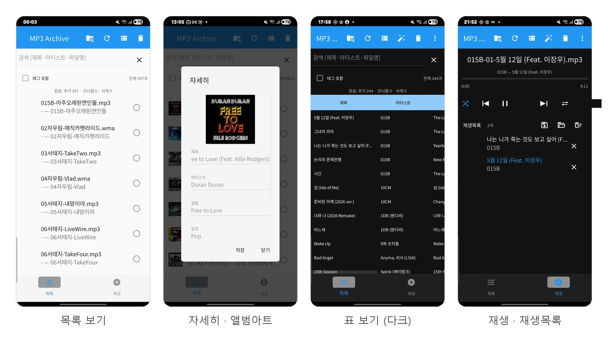

# mp3-archive

오디오 파일을 재귀적으로 스캔하여 메타데이터를 SQLite DB에 저장하고 관리하는 음악 관리 애플리케이션입니다. **데스크톱(PyQt6)** 과 **안드로이드(KivyMD)** 두 가지 앱을 제공하며, 스캔·태그·검색·온라인 메타데이터 백엔드는 두 앱이 공유합니다.

## UI 프리뷰

### 데스크톱 (PyQt6)


### 안드로이드 (KivyMD)



왼쪽부터 **목록 보기**, **자세히 + 앨범아트**(태그 편집 가능), **표 보기**(다크
테마), **재생 + 재생목록** 화면입니다.

---

## 기능

### 파일 스캔 및 관리

- **다양한 포맷 지원**: MP3, FLAC, OGG, WAV, M4A, WMA, Opus
- ID3 / VorbisComment / MP4 / ASF 태그 자동 읽기; 태그 없으면 파일명(`아티스트 - 제목.ext`)에서 파싱
- **증분 스캔**: 변경된 파일만 업데이트 (빠름) / **전체 스캔**: 모든 파일 강제 재읽기
- 파일 생성일시 / 수정일시 추적
- **디렉토리별 DB**: 음악 디렉토리 안에 `.mp3-archive.db`를 생성하여 DB를 관리; 디렉토리 전환 시 해당 DB를 자동으로 열고 증분 스캔 실행
- 경로 설정 저장 (QSettings, 앱 재시작 시 복원)
- 레코드 선택 삭제

### 재생

- 재생 목록에서 더블클릭으로 재생, 이전/다음 곡 이동
- 현재 재생 중인 곡의 앨범 아트 표시 (스플리터로 크기 조절 가능)

### 검색

- 파일명 검색 (기본) 또는 "태그 포함" 체크 시 제목·아티스트·앨범·장르·년도·코멘트 전체 검색
- 실시간 필터링 (타이핑하는 동시에 결과 갱신)

### 테이블 / 트리 뷰

- **Ctrl+T** 또는 툴바 버튼으로 테이블 ↔ 디렉토리 트리 전환
- 트리 뷰는 설정된 음악 경로를 루트로 하여 하위 폴더 구조를 표시
- 파일명, 경로, 제목, 아티스트, 앨범, 장르, 년도, 길이, 크기, 생성일시, 수정일시 표시
- 컬럼 헤더 클릭으로 정렬
- **헤더 우클릭**으로 표시할 컬럼 선택/숨김 (설정 저장됨)
- 모든 셀 호버 시 전체 내용 툴팁 표시
- **앨범 컬럼 툴팁**: 앨범 컬럼 호버 시 해당 트랙의 내장 앨범 아트를 이미지 툴팁으로 표시

### 태그 관리

- **태그 자동 완성**: MusicBrainz 또는 iTunes에서 태그를 검색해 파일과 DB에 자동 적용
  - 소스 선택 가능: MusicBrainz / iTunes / 둘 다 (Both)
  - 검색어 직접 입력하여 재검색 가능
  - 결과 없을 시 파일명으로 자동 재검색 후에도 없으면 팝업 알림
- **우클릭 메뉴** (테이블 및 트리 뷰 동일):
  - `자세히` — 파일에 내장된 모든 태그 + 앨범 아트 팝업 (편집 가능)
  - `인터넷에서 정보 보기` — MusicBrainz 곡 정보 조회 팝업
  - `가사 보기` — 파일에 내장된 가사 팝업
  - `태그 찾기` — 해당 행 태그 개별 검색

### 메뉴바

| 메뉴 | 항목 | 단축키 |
|------|------|--------|
| **파일** | 음악 경로 선택... | Ctrl+O |
| | 재생목록 저장... | Ctrl+S |
| | 재생목록 불러오기... | Ctrl+L |
| | 재생목록 비우기 | |
| | 종료 | Ctrl+Q |
| **스캔** | 빠른 스캔 | F5 |
| | 전체 스캔 | Ctrl+F5 |
| **보기** | 트리/테이블 전환 | Ctrl+T |
| | 테마 전환 | |
| **도움말** | About mp3-archive | F1 |

---

## 안드로이드 앱 (KivyMD)

데스크톱과 기능 패리티를 갖춘 안드로이드 앱입니다. 백엔드(`mp3_manager`,
`audio_meta`, `mb_fetcher`, `itunes_fetcher`, `online_meta`, `playlist`,
`table_util`, `ui_util`, `tree_util`)는 순수 Python으로 데스크톱과 공유하며,
UI 계층(`src/main_window_android.py`)만 KivyMD로 구현되어 있습니다.

### 기능

- **스캔 / 검색**: 인앱 파일 관리자로 폴더 선택 → 증분 스캔(폴더 병합, 미변경
  건너뜀) / 새로고침으로 전체 재스캔; 파일명·태그 실시간 검색
- **보기 모드 5종**: 목록 / 자세히(앨범아트) / 트리 / 타일 / **표**(컬럼
  선택·헤더 탭 정렬·가로 스크롤)
- **정렬 / 테마 / 정보**: ⋮ 오버플로 메뉴 (이름·아티스트·제목·날짜 정렬,
  시스템/라이트/다크 테마, 버전 표시)
- **태그**: `자세히`에서 파일·스트림 정보 + 모든 내장 태그 편집, `가사`,
  `온라인 정보`(MusicBrainz/iTunes/둘 다 + 후보별 변경 diff + 키워드 검색),
  롱프레스 `재생목록에 추가`(선택 곡 일괄), **태그 자동 완성** 배치
- **재생목록 / 큐**: 탭하면 큐에 추가+재생, 재생 탭에 큐 표시(재생중 강조·삭제),
  이전/다음, 재생모드(순차·한곡반복·전체반복·셔플), 곡 끝나면 자동 다음곡,
  `.list` 저장/불러오기(없는 파일 건너뜀)/비우기, 트리 폴더 롱프레스로 폴더
  전체 추가
- **플레이어**: 볼륨 슬라이더(+음소거), 드래그 시크, 재생 탭 앨범아트(없으면
  기본 이미지) + 가사 토글
- **로딩 화면**: 흰 배경 + 앱 아이콘 + 버전

### 빌드

GitHub Actions(`.github/workflows/build.yml`)가 main 푸시마다 디버그 APK를
빌드해 `mp3-archive-debug` 아티팩트로 올립니다. 같은 워크플로를 수동 실행
(Actions → Build → Run workflow)하면 `platform` 입력으로 안드로이드 / 윈도우 /
둘 다를 선택해 원하는 빌드만 돌릴 수 있습니다 (윈도우는 EXE + MSI 산출). 로컬
빌드는 buildozer:

```bash
pip install buildozer
buildozer -v android debug
# 결과물: bin/*.apk
```

설정은 `buildozer.spec` 참고 (python-for-android v2024.01.21, CPython 3.11,
kivy 2.3.0 / kivymd 1.2.0). 로딩 화면 이미지는
`python assets/make_presplash.py`로, 위의 UI 프리뷰 몽타주는
`python assets/make_android_preview.py`(소스 스크린샷: `assets/android-shots/`)로
재생성합니다.

---

## 다이얼로그 프리뷰

### 태그 자동 완성 (`tag_fetch_dialog`)

MusicBrainz / iTunes 에서 태그를 검색하여 일괄 적용합니다.
태그가 없는 파일만 큐에 올라오며, 파일명을 검색어 기본값으로 사용합니다.


---

### 태그 상세 보기 (`tag_detail_dialog`)

파일에 내장된 모든 태그 키-값을 테이블로 표시하며, 앨범 아트도 함께 보여줍니다.
편집 가능한 셀을 수정 후 저장 버튼으로 파일과 DB에 반영합니다.


---

### 인터넷 곡 정보 (`song_info_dialog`)

MusicBrainz에서 선택한 곡의 정보를 조회하고 태그로 적용할 수 있습니다.


---

### 가사 보기 (`lyrics_dialog`)

파일에 내장된 가사를 표시합니다.
ID3 USLT (MP3), Vorbis LYRICS (FLAC/OGG), MP4 ©lyr 포맷을 지원합니다.


---

## 요구사항

```
pip install -r requirements.txt
```

- Python 3.10+
- PyQt6
- mutagen
- musicbrainzngs

## 실행

```bash
python main.py
```

또는 직접 실행:

```bash
python src/main_window.py
```

## 빌드

### Windows — EXE

```bash
pyinstaller build/windows.spec
# 결과물: dist/mp3-archive/mp3-archive.exe  (onedir 번들)
```

### Windows — MSI (설치 패키지)

[WiX Toolset v3](https://github.com/wixtoolset/wix3/releases)가 필요합니다.
버전은 `NEWS` 파일의 최신 항목(`vYYYYMMDD`)에서 자동 추출됩니다.

```powershell
# EXE 빌드 + MSI 패키징 (프로젝트 루트에서 실행)
powershell -ExecutionPolicy Bypass -File build\build_msi.ps1
```

> `LICENSE.rtf`가 없으면 `python build/make_license_rtf.py`로 먼저 생성하세요.

결과물: `dist/mp3-archive.msi`

- NEWS의 최신 버전(`vYYYYMMDD` → `YYYY.M.D.0`)이 MSI에 반영됨
- `C:\Program Files\mp3-archive\` 에 설치
- 시작 메뉴 및 바탕화면 바로가기 생성
- 프로그램 추가/제거에 등록, 언인스톨러 포함

### Linux — 단일 실행 파일

```bash
pyinstaller build/linux.spec
# 결과물: dist/mp3-archive
```

### Linux — DEB 패키지

`dpkg-deb`(Debian/Ubuntu 기본 포함)가 필요합니다.

```bash
# 버전을 NEWS에서 자동 추출 (e.g. v20260407 → 20260407)
bash build/package_deb.sh

# 버전 직접 지정
bash build/package_deb.sh 20260407
# 결과물: dist/mp3-archive_20260407_amd64.deb
```

```bash
# 설치
sudo dpkg -i dist/mp3-archive_1.0.0_amd64.deb

# 제거
sudo dpkg -r mp3-archive
```

- `/usr/lib/mp3-archive/` 에 onedir 번들 설치
- `/usr/bin/mp3-archive` 래퍼 스크립트 생성 (PATH에서 바로 실행 가능)
- 앱 런처(`.desktop`) 및 아이콘 등록

## 테스트

```bash
python -m unittest discover -s test -v
```

## 디렉토리 구조

```
mp3-archive/
├── src/
│   ├── mp3_manager.py          # 스캔 및 SQLite 관리 라이브러리 (공유)
│   ├── audio_meta.py           # 앨범아트/가사/태그/스트림 헬퍼 (공유)
│   ├── main_window.py          # PyQt6 데스크톱 UI
│   ├── main_window.ui          # Qt Designer 레이아웃
│   ├── main_window_android.py  # KivyMD 안드로이드 UI
│   ├── tag_fetcher.py          # MusicBrainz 태그 검색 (musicbrainzngs)
│   ├── mb_fetcher.py           # 의존성 없는 MusicBrainz 검색 (안드로이드)
│   ├── itunes_fetcher.py       # iTunes Search API 연동 (공유)
│   ├── net_util.py             # HTTPS/CA 컨텍스트 (공유)
│   ├── online_meta.py          # 온라인 메타 쿼리/병합/배치 큐 헬퍼
│   ├── playlist.py             # 재생목록/큐 모델 + 재생모드 로직
│   ├── table_util.py           # 표 보기 컬럼 모델 + 정렬
│   ├── ui_util.py              # 정렬 / 테마 / 버전 헬퍼
│   ├── tree_util.py            # 디렉토리 트리 빌더 + 폴더 파일 수집
│   ├── default_art.png         # 앨범아트 없는 곡의 기본 이미지 (안드로이드)
│   ├── tag_fetch_dialog.py     # 태그 일괄 자동 완성 다이얼로그 (데스크톱)
│   ├── tag_detail_dialog.py    # 전체 태그 상세 + 앨범 아트 팝업 (데스크톱)
│   ├── song_info_dialog.py     # 인터넷 곡 정보 팝업 (데스크톱)
│   └── lyrics_dialog.py        # 내장 가사 팝업 (데스크톱)
├── test/                       # 테스트 코드
├── build/                      # PyInstaller spec 파일
├── docs/                       # UI 및 다이얼로그 프리뷰 이미지
├── assets/                     # 아이콘, 로딩 화면 등 리소스
├── skills/                     # 기능 계획 문서 (*.md)
├── buildozer.spec              # 안드로이드 빌드 설정
├── .github/workflows/          # CI (안드로이드 APK 빌드)
├── main.py                     # 데스크톱 진입점
└── requirements.txt
```
